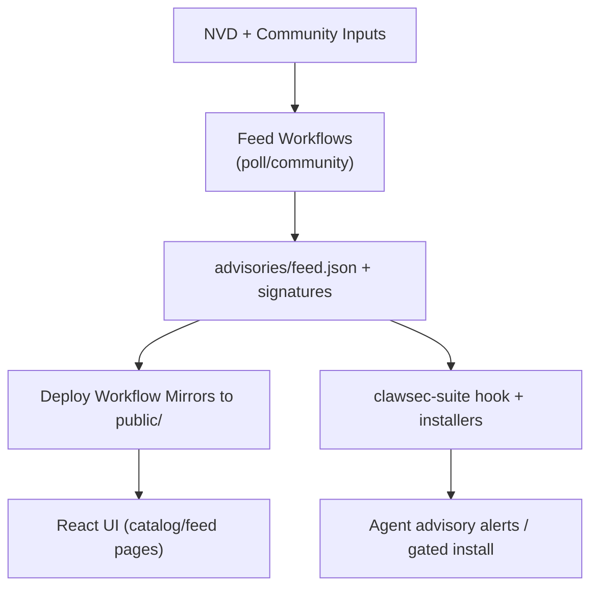

# Architecture

## System Context
- This page appears under the `Start Here` section in `INDEX.md`.
- ClawSec sits between upstream intelligence sources (NVD + community issues), GitHub automation, and runtime agent environments.
- The repository publishes both static site content and signed artifacts that runtime skills verify before using.
- External actor groups:
  - GitHub Actions runners executing CI, release, and feed workflows.
  - OpenClaw/NanoClaw agents consuming skills, advisories, and verification scripts.
  - Repository maintainers approving advisory issues and merging release/tag changes.

## Components
| Component | Location | Responsibility |
| --- | --- | --- |
| Web UI | `App.tsx`, `pages/`, `components/` | Renders skills catalog and advisory detail experiences. |
| Advisory Feed Core | `advisories/feed.json*`, `skills/clawsec-suite/.../feed.mjs` | Stores, verifies, and parses advisories with detached signatures/checksums. |
| Skill Packages | `skills/*/` | Distributes installable security capabilities with SBOM metadata. |
| Local Automation Scripts | `scripts/*.sh` | Build local mirrors, pre-push checks, and manual release helpers. |
| CI/CD Workflows | `.github/workflows/*.yml` | Linting, tests, NVD polling, release packaging, and Pages deploy. |
| Python Utility Layer | `utils/*.py` | Skill metadata validation and checksum generation. |

## Key Flows
- Skill catalog flow:
  1. Release/tag workflows publish skill assets.
  2. Deploy workflow discovers release assets and builds `public/skills/index.json`.
  3. UI fetches `public/skills/index.json` and skill docs for `/skills` pages.
- Advisory feed flow:
  1. `poll-nvd-cves.yml` and `community-advisory.yml` update `advisories/feed.json`.
  2. Feed is signed and mirrored to public paths.
  3. Runtime hooks/scripts load remote feed and fallback to local signed copies.
- Guarded install flow:
  1. Installer requests target skill + version.
  2. Advisory matcher checks affected specifiers and severity/risk hints.
  3. Exit code 42 enforces second confirmation when advisories match.

## Diagrams



## Interfaces and Contracts
| Interface | Contract Form | Validation |
| --- | --- | --- |
| Skill metadata | `skills/*/skill.json` | Validated by Python utility + CI version-parity checks. |
| Advisory feed | JSON + Ed25519 detached signature | Verified by `feed.mjs` and NanoClaw signature utilities. |
| Checksums manifest | `checksums.json` (+ optional `.sig`) | Parsed and hash-matched before trusting payloads. |
| Hook event interface | `HookEvent` (`type`, `action`, `messages`) | Runtime handler only processes selected event names. |
| Workflow release naming | Tag pattern `<skill>-vX.Y.Z` | Parsed in release/deploy workflows to discover skills. |

## Key Parameters
| Parameter | Default | Effect |
| --- | --- | --- |
| `CLAWSEC_FEED_URL` | `https://clawsec.prompt.security/advisories/feed.json` | Remote advisory source for suite scripts/hooks. |
| `CLAWSEC_ALLOW_UNSIGNED_FEED` | `0` | Enables temporary unsigned fallback compatibility. |
| `CLAWSEC_VERIFY_CHECKSUM_MANIFEST` | `1` | Requires checksum manifest verification where available. |
| `CLAWSEC_HOOK_INTERVAL_SECONDS` | `300` | Scan throttling window for advisory hook. |
| `CLAWSEC_SKILLS_INDEX_TIMEOUT_MS` | `5000` | Remote skill index fetch timeout for catalog discovery. |
| `PROMPTSEC_GIT_PULL` | `0` | Optional auto-pull before watchdog audit runs. |

## Error Handling and Reliability
- Feed fetching is fail-closed for invalid signatures and malformed manifests.
- Remote fetch failures gracefully fall back to local signed feeds.
- Hook state uses atomic file writes with strict mode where supported.
- UI pages detect HTML fallbacks served as JSON and avoid rendering corrupted data.
- Workflow steps enforce key-fingerprint consistency to avoid split-key drift.

## Example Snippets
```tsx
// Route topology in the web app
<Routes>
  <Route path="/" element={<Home />} />
  <Route path="/skills" element={<SkillsCatalog />} />
  <Route path="/skills/:skillId" element={<SkillDetail />} />
  <Route path="/feed" element={<FeedSetup />} />
  <Route path="/feed/:advisoryId" element={<AdvisoryDetail />} />
</Routes>
```

```ts
// Guarded feed loading contract in advisory hook
const remoteFeed = await loadRemoteFeed(feedUrl, {
  signatureUrl: feedSignatureUrl,
  checksumsUrl: feedChecksumsUrl,
  checksumsSignatureUrl: feedChecksumsSignatureUrl,
  publicKeyPem,
  checksumsPublicKeyPem: publicKeyPem,
  allowUnsigned,
  verifyChecksumManifest,
});
```

## Runtime and Deployment
| Runtime Surface | Execution Model | Output |
| --- | --- | --- |
| Vite app (`npm run dev`) | Local frontend server | Interactive web app for feed/skills. |
| GitHub CI | Multi-OS matrix + dedicated jobs | Lint/type/build/security and test confidence. |
| Skill release workflow | Tag-driven | Release assets, signed checksums, optional ClawHub publish. |
| Pages deploy workflow | Triggered by CI/Release success | Static site + mirrored advisories/releases. |
| Runtime hooks | OpenClaw event hooks / NanoClaw IPC | Advisory alerts, gating decisions, integrity checks. |

## Scaling Notes
- Advisory volume scales with keyword set in NVD polling; dedupe and post-filtering control noise.
- Deploy workflow processes release lists and keeps newest skill versions in index output.
- Module boundaries by skill folder allow adding new security capabilities without changing frontend structure.
- Signature verification paths remain lightweight because payload sizes (feed/manifests) are small.

## Source References
- App.tsx
- pages/SkillsCatalog.tsx
- pages/FeedSetup.tsx
- pages/AdvisoryDetail.tsx
- skills/clawsec-suite/hooks/clawsec-advisory-guardian/handler.ts
- skills/clawsec-suite/hooks/clawsec-advisory-guardian/lib/feed.mjs
- skills/clawsec-suite/scripts/guarded_skill_install.mjs
- skills/clawsec-suite/scripts/discover_skill_catalog.mjs
- skills/clawsec-nanoclaw/lib/advisories.ts
- skills/clawsec-nanoclaw/lib/signatures.ts
- .github/workflows/poll-nvd-cves.yml
- .github/workflows/community-advisory.yml
- .github/workflows/deploy-pages.yml
- .github/workflows/skill-release.yml
