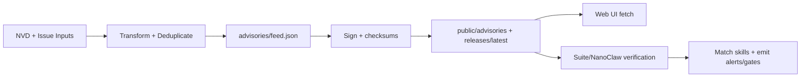

# Data Flow

## Primary Flows
- `Advisory ingestion`: NVD/community inputs are transformed into a normalized advisory feed, signed, then mirrored for clients.
- `Skill catalog publication`: release assets are discovered and converted into `public/skills/index.json` plus per-skill docs/checksums.
- `Runtime enforcement`: suite and nanoclaw consumers load advisory data, match against skills, and emit alerts or confirmation gates.
- This page appears under the `Guides` section in `INDEX.md`.

## Step-by-Step
1. Feed producer workflow/script fetches source data (`NVD API` or issue payload).
2. JSON transform logic normalizes severity/type/affected fields and deduplicates by advisory ID.
3. Signature/checksum steps generate detached signatures and checksum manifests.
4. Deploy workflow mirrors signed artifacts under `public/` and `public/releases/latest/download/`.
5. UI and runtime consumers fetch feed/index files and validate format/signatures before use.
6. Matchers compare `affected` specifiers to skill names/versions and emit alerts or enforce confirmation.

## Inputs and Outputs
Inputs/outputs are summarized in the table below.

| Type | Name | Location | Description |
| --- | --- | --- | --- |
| Input | CVE payloads | `services.nvd.nist.gov/rest/json/cves/2.0` | Source vulnerabilities filtered by ClawSec keywords. |
| Input | Community advisory issue | `.github/workflows/community-advisory.yml` event payload | Maintainer-approved issue transformed into advisory record. |
| Input | Skill release assets | GitHub Releases API + assets | Used to build web catalog and mirror downloads. |
| Input | Local config/env | `OPENCLAW_AUDIT_CONFIG`, `CLAWSEC_*` vars | Controls feed pathing, suppression, and verification behavior. |
| Output | Advisory feed | `advisories/feed.json` | Canonical repository feed. |
| Output | Advisory signature | `advisories/feed.json.sig` | Detached signature for feed authenticity. |
| Output | Skill catalog index | `public/skills/index.json` | Runtime web catalog used by `/skills` pages. |
| Output | Release checksums/signatures | `release-assets/checksums.json(.sig)` | Integrity manifest for release consumers. |
| Output | Hook state | `~/.openclaw/clawsec-suite-feed-state.json` | Tracks scan timing and notified matches. |

## Data Structures
| Structure | Key Fields | Purpose |
| --- | --- | --- |
| Advisory feed record | `id`, `severity`, `type`, `affected[]`, `published` | Unit of risk data used by UI and installers. |
| Skill metadata record | `id`, `name`, `version`, `emoji`, `tag` | Catalog row for web browsing and install commands. |
| Checksums manifest | `schema_version`, `algorithm`, `files` | Maps file names to expected digests. |
| Advisory state | `known_advisories`, `last_hook_scan`, `notified_matches` | Prevents repeated alerts and throttles scans. |
| Suppression config | `enabledFor[]`, `suppressions[]` | Targeted skip list by `checkId` + `skill`. |

## Diagrams


## State and Storage
| Store | Path/Scope | Write Path |
| --- | --- | --- |
| Canonical advisories | `advisories/` | NVD + community workflows and local populate script. |
| Embedded advisory copies | `skills/clawsec-feed/advisories/` and `skills/clawsec-suite/advisories/` | Sync/packaging processes and release workflow. |
| Public mirrors | `public/advisories/`, `public/releases/` | Deploy workflow. |
| Runtime state | `~/.openclaw/clawsec-suite-feed-state.json` | Advisory hook state persistence. |
| NanoClaw cache | `/workspace/project/data/clawsec-advisory-cache.json` | Host-side advisory cache manager. |
| Integrity state | `/workspace/project/data/soul-guardian/` (NanoClaw) | Integrity monitor baseline/audit storage. |

## Example Snippets
```bash
# Local feed flow (NVD fetch -> transform -> sync)
./scripts/populate-local-feed.sh --days 120
jq '.updated, (.advisories | length)' advisories/feed.json
```

```bash
# Runtime guarded install uses signed feed paths
CLAWSEC_LOCAL_FEED=~/.openclaw/skills/clawsec-suite/advisories/feed.json \
CLAWSEC_FEED_PUBLIC_KEY=~/.openclaw/skills/clawsec-suite/advisories/feed-signing-public.pem \
node skills/clawsec-suite/scripts/guarded_skill_install.mjs --skill test-skill --dry-run
```

## Failure Modes
- NVD rate limits (`403/429`) can delay feed refresh and require retries/backoff.
- Missing or invalid detached signatures cause feed rejection in fail-closed mode.
- HTML fallback responses for JSON endpoints can produce false positives unless explicitly filtered.
- Path-token misconfiguration (`\$HOME`) can break local fallback path resolution.
- Mismatched public key fingerprints in workflows trigger hard CI failure.

## Source References
- advisories/feed.json
- advisories/feed.json.sig
- scripts/populate-local-feed.sh
- scripts/populate-local-skills.sh
- .github/workflows/poll-nvd-cves.yml
- .github/workflows/community-advisory.yml
- .github/workflows/deploy-pages.yml
- .github/workflows/skill-release.yml
- skills/clawsec-suite/hooks/clawsec-advisory-guardian/lib/feed.mjs
- skills/clawsec-suite/hooks/clawsec-advisory-guardian/lib/state.ts
- skills/clawsec-suite/hooks/clawsec-advisory-guardian/lib/matching.ts
- skills/clawsec-suite/scripts/guarded_skill_install.mjs
- skills/clawsec-nanoclaw/lib/advisories.ts
- skills/clawsec-nanoclaw/host-services/advisory-cache.ts
